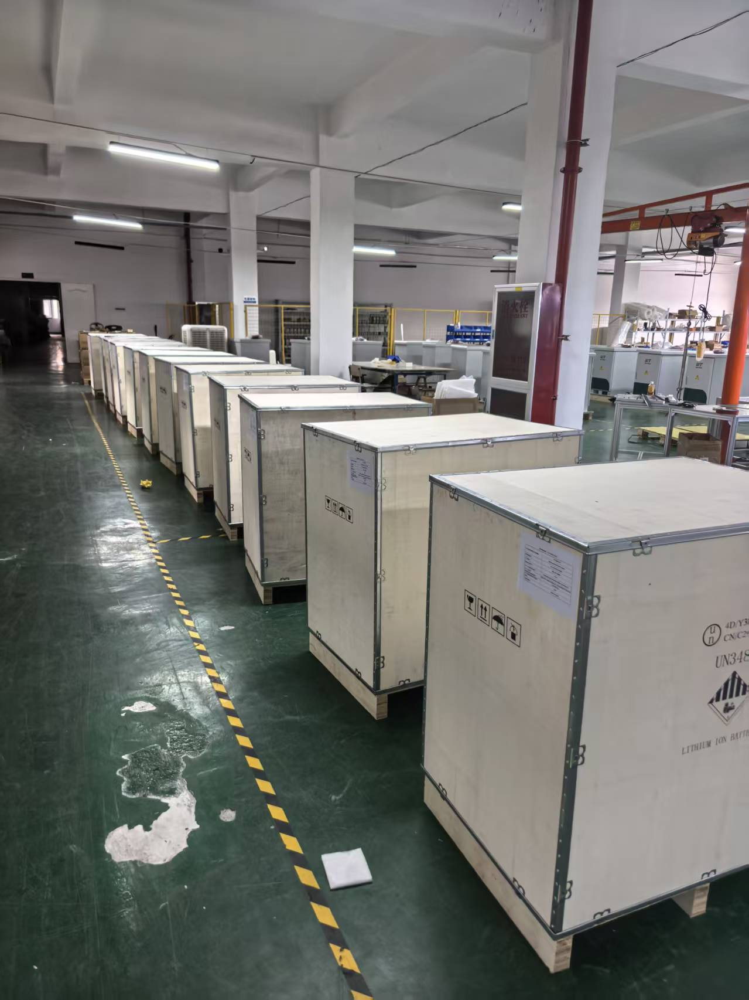
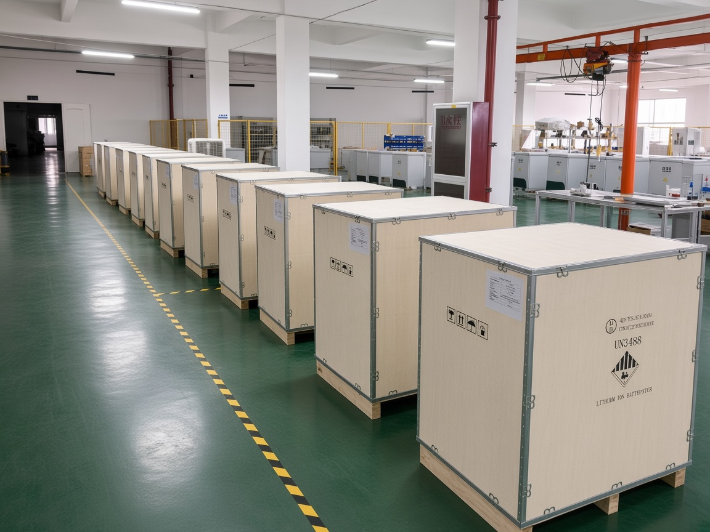

# 工厂环境清理

把工厂、仓库、产线的实拍照片处理成干净、整齐、通透、偏高端的工业现场效果。只改环境，不改产品和人。适合仓储柜、木箱、锂电池包装（如 UN3480）等发货或仓储照片。

Cursor skill 名称：`factory-environment-cleanup`。详细规则见 [`SKILL.md`](SKILL.md)。

## 主要用途

- 发货、验货、产品页、宣传物料需要「现场看起来更专业」，但不想重拍。
- 原图里地面脏、杂物多、灯光乱、空间显得挤，需要统一成干净工业仓的观感。
- 产品和包装必须可核对：木箱、托盘、唛头、危险品标、装箱单、人物都要保持原样。

## 功能

- **只升级环境：** 清理杂物、污渍、散乱工具；地面做成平整光洁的工业地坪；墙柱天花整齐明亮；灯光更均匀、更有品质感。
- **锁定产品与人：** 木箱、纸箱、缠膜托盘、唛头、UN3480 / Lithium Ion Battery 等标识、人物姿态与位置一律不改。
- **默认出图尺寸：** 宽 1080 px，比例 4:3（高 810 px）。机位、构图、透视默认与原图一致。
- **可继续微调：** 清洁力度、灯光、去掉某一件杂物等，可在上一版结果上再改。

## 用法

1. 把原图放到 `input/`，可按批次建子文件夹（例如发货日期）。
2. 在 Cursor 里说明要做「工厂环境清理」，并附上照片；或直接使用本仓库的 skill。
3. 处理后的图放到 `output/`，默认按 1080 × 4:3 输出。
4. 如需更干净、更亮、或去掉指定物体，在上一张结果上继续提要求即可。

本机其它照片不要提交到 Git。仓库里只保留下面这一组前后对比作为实例。

## 适用模型

不是「能看图」就行，必须能 **拿原图改图**。木箱、托盘、UN3480、装箱单、人要保持原样，只改地面、墙、灯光和杂物。请分清三种能力：

| 能力 | 做什么 | 对本 skill |
|---|---|---|
| **看图** | 看懂照片、写说明 | 有帮助，但交不出处理后的图 |
| **文生图** | 按文字新画一张 | 不够，木箱和标签很容易被重画丢 |
| **图生图 / 指令修图** | 以上传原图为底，只改环境 | **必须有** |

### 在 Cursor 里

Skill 是说明书。真正出像素的是 Cursor 自带的生图工具（底层目前是 Google Nano Banana Pro），不是对话框里选的 DeepSeek / 豆包对话模型。

- 对话框选 **Composer 2.5、GPT、Claude、Gemini、Grok** 等能看图、能调工具的模型，就可以跑这个 skill。
- 聊天模型负责：读 skill、看原图、写「锁产品、改环境」的指令。
- 日常在 Cursor 里跑这套，用 **Composer 2.5** 即可。

### DeepSeek / 豆包 / MiniMax 等

| 模型 / 产品 | 看图 | 文生图 | 按原图修工厂照 | 结论 |
|---|---|---|---|---|
| **DeepSeek 对话**（V3 / V4 / R1 等） | 部分看图实验，主产品仍是文本 | 官方对话 / API **不生图** | **不能** | 当聊天模型也 **完不成** 这个 skill |
| **DeepSeek Janus-Pro** | 有 | 有（约 384×384） | 基本没有可用的商用修图 | 研究向，**不适合** 这套发货图 |
| **豆包 对话模型** | 能看图 | 不负责出图 | **不能单独完成** | 要出图得走下面的生图模型 |
| **豆包 / 即梦 Seedream 4.0、5.0 Pro** | 能 | 能 | **能**（图生图 + 指令编辑） | 在豆包 / 即梦 / 火山方舟里可做同类事，但 **不是** Cursor 这个 skill 的引擎 |
| **MiniMax 对话**（M 系列等） | 部分多模态 | 否 | **不能单独完成** | 同 DeepSeek 对话 |
| **MiniMax image-01** | — | 能，也支持图生图 | **部分可以**，锁定唛头 / UN3480 不如专用修图模型稳 | 要走 MiniMax 自己的生图接口，Cursor 接不上 |
| **GPT Image / gpt-image** | 能 | 能 | **能**，参考图修图很合适 | ChatGPT 或走图像接口时可用 |
| **Gemini（Nano Banana / 图像模型）** | 能 | 能 | **能**；Cursor 生图目前就是这一路 | **最贴合本 skill** |
| **通义万相 / Qwen-Image** | 能 | 能 | **能做图生图** | 在阿里云 / 通义里用，不是 Cursor skill |
| **Kimi / Claude 对话** | 能看图 | 自身 **不生图** | 在 Cursor 里靠调生图工具才能出图 | 适合当「导演」，不能当「画师」 |

**一句话：** 要的是指令修图 / 图生图，不是任意能看图的大模型。在 Cursor 里选能看图的 Agent（推荐 Composer 2.5），出图走 Cursor 生图。DeepSeek、豆包对话、MiniMax 对话本身交不出清理后的工厂照；豆包要用 Seedream，MiniMax 要用 image-01，而且都是各自 App / API，不是这个 skill 在 Cursor 里的通路。

## 示例

处理前（`input/20260901发货i/example-in.jpg`）：

处理后（`output/20260901发货/example-out.jpg`）：

对比要点：木箱、托盘、UN3480 锂电池标、装箱单保持不变；地面、通道线、墙柱和灯光更干净整齐，空间更通透。
